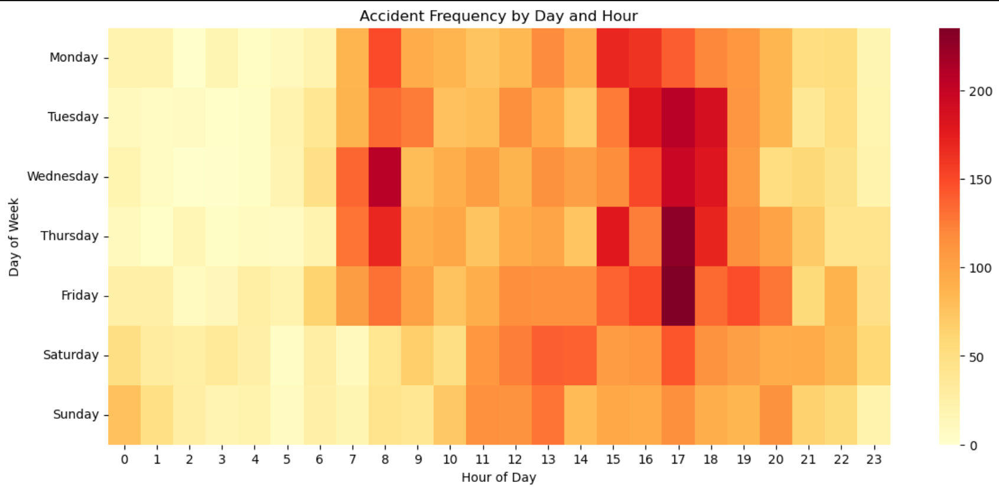
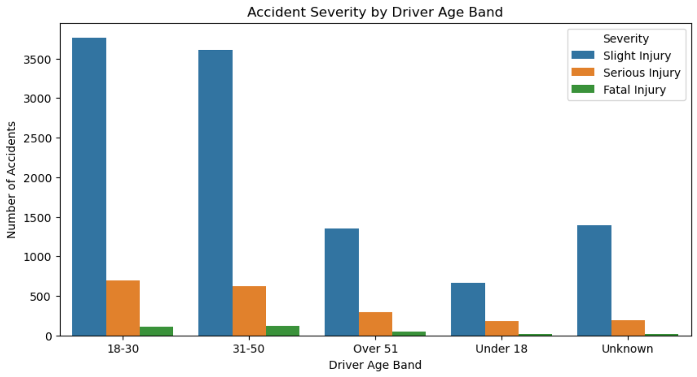

# Addis Ababa Traffic Accident Analysis

**Dataset:** Addis Ababa City Road Traffic Accident Severity
**Author:** Avinab
**Date:** 21 April 2025

---

## Project Overview

This project analyzes road traffic accidents in Addis Ababa to uncover patterns and risk factors, and to recommend targeted interventions for reducing accident frequency and severity.
The analysis combines exploratory data analysis, visualization, and predictive modeling.

---

## Setup

1. Clone this repo and install dependencies:

```bash
pip install -r requirements.txt
```

2. Place `accident_data.csv` in the `data/` folder.
3. Run `notebooks/accident_analysis.ipynb`.

---

## Key Insights

### Accident Severity Patterns

| Severity Type | % of Accidents | Recommendation |
| :-- | :-- | :-- |
| Slight Injury | High | Maintain strong first aid/minor injury response |
| Serious/Fatal | Low but critical | Prioritize prevention and rapid severe-case response |

---

### Temporal Patterns

| Pattern | Insight/Pattern | Recommendation |
| :-- | :-- | :-- |
| Peak hours | 8–10 AM, 4–7 PM | Intensify enforcement and awareness |
| Day of week | Most accidents on Fridays | Focus campaigns/patrols on Fridays |
| Heatmap (see below) | Late afternoon/evening is riskiest across days | Deploy more resources at these hours |

---

### Driver \& Vehicle Risk Factors

| Factor | High-Risk Group/Condition | Recommendation |
| :-- | :-- | :-- |
| Age | Under 18, Over 51 | Targeted education, stricter licensing |
| Driving Experience | 2–5 years, Unknown | Extra training \& verification |
| Vehicle Type | Long lorry, Motorcycle | Stricter regulation, safety checks |
| Number of Vehicles | Multi-vehicle accidents = higher severity | Prioritize multi-vehicle prevention |

---

### Environmental \& Behavioral Factors

| Factor/Condition | Key Insight | Recommendation |
| :-- | :-- | :-- |
| Light Conditions | Darkness (unlit) = highest severe risk | Upgrade lighting, night safety campaigns |
| Road Surface \& Weather | Wet/damp, windy = higher severity risk | Improve drainage, issue warnings |
| Top Causes | No distancing, careless driving, lane changes | Enforce safe distance, lane discipline |
| Fatal Accident Causes | Drugs, overloading, improper parking | Targeted enforcement/awareness |

---

## Visualizations

### 1. Accident Heatmap by Day and Hour

```python
import seaborn as sns
import matplotlib.pyplot as plt
import pandas as pd

# Assuming df is your cleaned DataFrame
day_order = ['Monday', 'Tuesday', 'Wednesday', 'Thursday', 'Friday', 'Saturday', 'Sunday']
df['Hour'] = pd.to_datetime(df['Time'], format='%H:%M:%S').dt.hour
heatmap_data = pd.crosstab(df['Day_of_week'], df['Hour']).reindex(day_order)

plt.figure(figsize=(14, 6))
sns.heatmap(heatmap_data, cmap='YlOrRd')
plt.title('Accident Frequency by Day and Hour')
plt.xlabel('Hour of Day')
plt.ylabel('Day of Week')
plt.show()
```


*Interpretation: Late afternoons and evenings (16:00–19:00) show highest accident density, especially on weekdays.*

---

### 2. Age Distribution and Severity

```python
plt.figure(figsize=(10, 5))
sns.countplot(x='Age_band_of_driver', hue='Accident_severity', data=df, order=sorted(df['Age_band_of_driver'].unique()))
plt.title('Accident Severity by Driver Age Band')
plt.xlabel('Driver Age Band')
plt.ylabel('Number of Accidents')
plt.legend(title='Severity')
plt.show()
```


*Interpretation: Under 18 and over 51 drivers have a higher proportion of severe/fatal accidents. These groups need targeted education and licensing scrutiny.*

---

## Summary of Recommendations

- **Enforce and educate** on safe driving for all ages and experience levels, especially 2–10 years and young/elderly drivers.
- **Target high-risk times and locations** with increased patrols and public awareness (rush hours, Fridays, night/dark areas).
- **Upgrade infrastructure** (lighting, drainage) and enforce safety for high-risk vehicles and behaviors.
- **Broaden safety campaigns** to include all weather and road conditions, not just the obvious risks.
- **Improve data and modeling** for better prediction and prevention of severe/fatal accidents.

---

## Summary of All Key Insights

| Area | Key Insight / Pattern | Actionable Recommendation |
| :-- | :-- | :-- |
| Severity | Most are minor, but severe/fatal need focus | Prioritize severe-case prevention and response |
| Time | Peaks at rush hours, Fridays, late afternoons | Intensify enforcement and awareness at these times |
| Driver Factors | Young/elderly, 2–5yr experience, unknown experience at risk | Targeted education, stricter licensing |
| Vehicle Factors | Multi-vehicle, lorry, motorcycle = higher severity | Stricter checks, prioritize multi-vehicle response |
| Environment | Wet/damp, darkness, windy = higher severity risk | Upgrade lighting, drainage, issue warnings |
| Behaviors | No distancing, lane change, careless, drugs, overloading | Enforce, educate, and target high-fatality causes |

---

## License

[MIT License](LICENSE)

---

*For questions or contributions, please open an issue or pull request.*

---